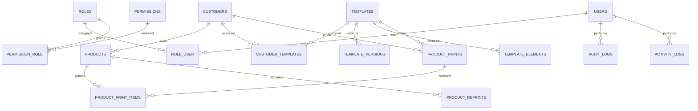

# Labeling Management System ERD

Core relationships:

High-volume indexes are placed on customer/status/date access paths, product SKU/customer lookups, print job status, audit polymorphic lookups, and template assignment joins.
